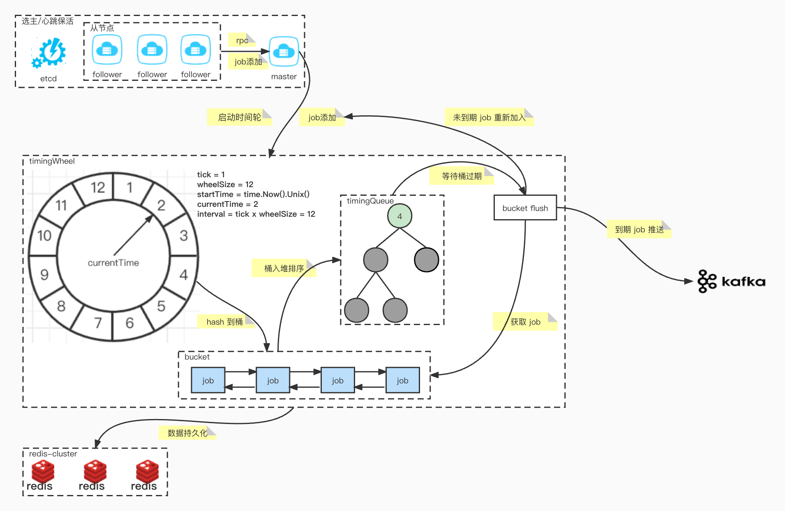

### 分布式延迟调度

简体中文 | [English](README.md)

基于层级时间轮算法实现延迟任务调度，致力于打造高性能的分布式延迟任务调度器。

##### 项目简介

- manager: 集群通信协议规范
- mq: 消息队列
    - producer: 消息生产
    - consumer: 消息消费
- node: 用于观察集群状态变更
- timingwheel: 时间轮的实现
    - job: 最小调度单元
    - bucket: 用于存储一个时间段内的任务
    - timingqueue: 最小堆的实现
- utils: 其他工具
- workerpool: 可伸缩的分片协程池

##### 架构

##### 依赖

- [etcd](https://github.com/etcd-io/etcd) v3.5.4
- [redis](https://github.com/go-redis/redis) v8.11.5
- [kafka](https://github.com/segmentio/kafka-go)
