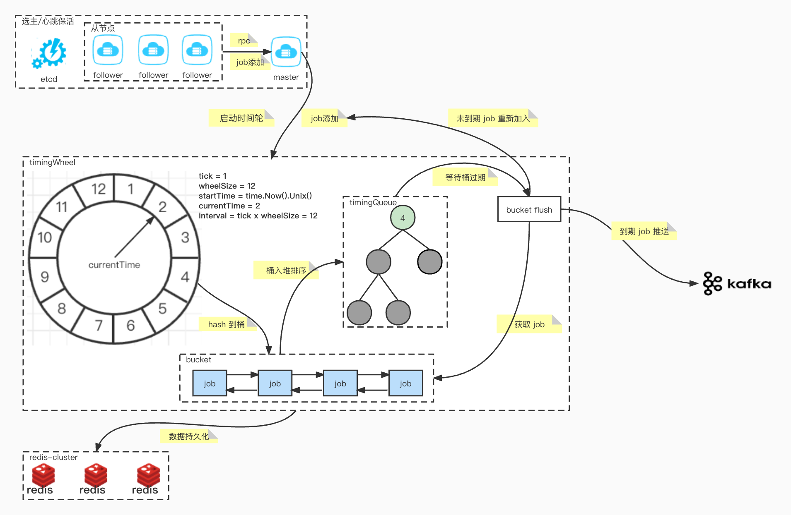

### Distributed Delay Scheduler

English | [简体中文](README-CN.md)

Based on the hierarchical time while algorithm to achieve delayed 
task scheduling, we are committed to building a high-performance 
distributed delayed task scheduling system.

##### Project Description

- manager: cluster communication protocol specification          
- mq: message queue
  - producer: message product               
  - consumer: message consume           
- node: use for watch cluster state change                      
- timingwheel: implementation of the time wheel
    - job: the smallest unit of scheduling                
    - bucket: used to store jobs for a certain period of time         
    - timingqueue: implementation of min heap
- utils: other tools
- workerpool: elastically scalable sharding goroutine pool

##### Architecture

##### Dependency

- [etcd](https://github.com/etcd-io/etcd) v3.5.4
- [redis](https://github.com/go-redis/redis) v8.11.5
- [kafka](https://github.com/segmentio/kafka-go)
